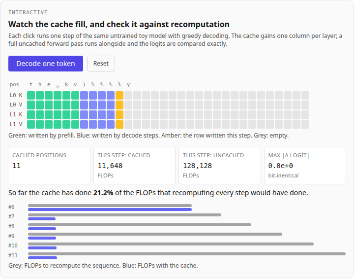
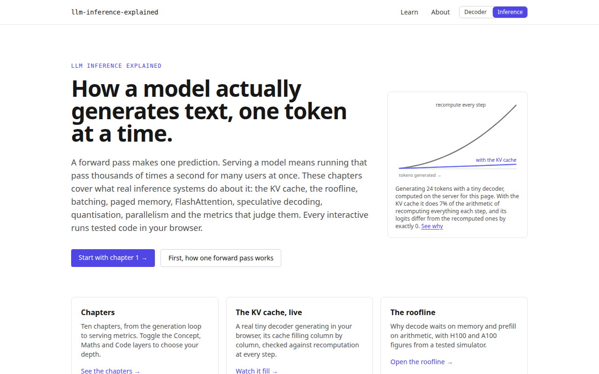
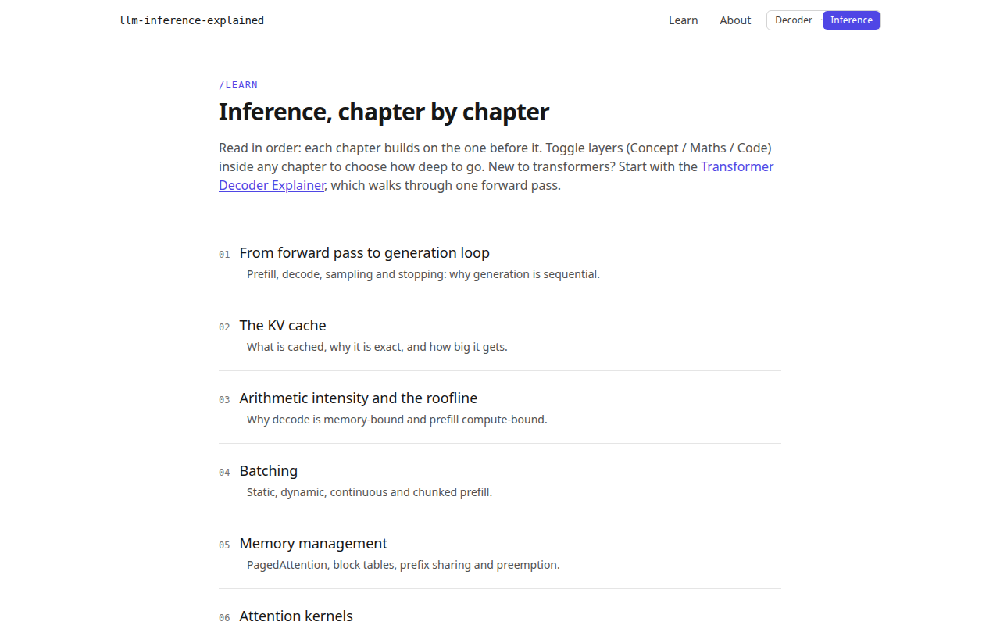
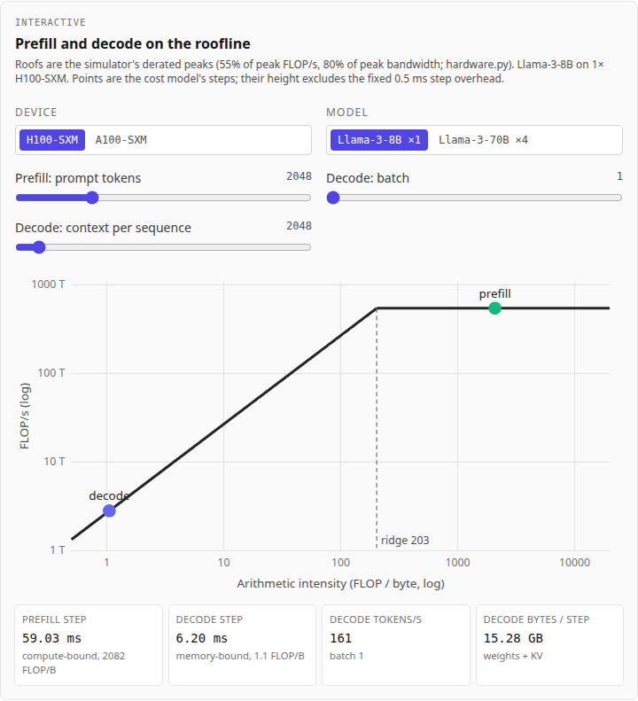
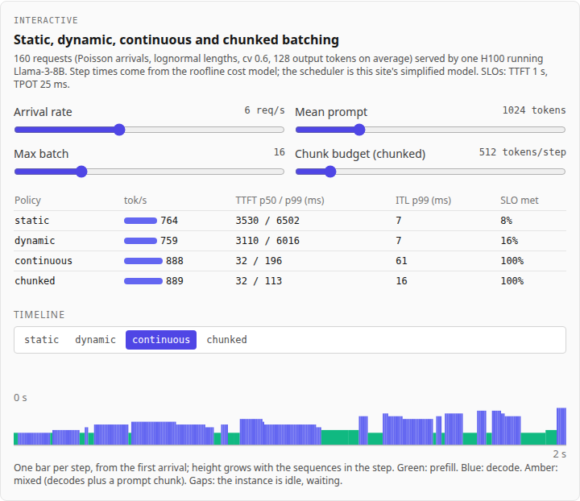
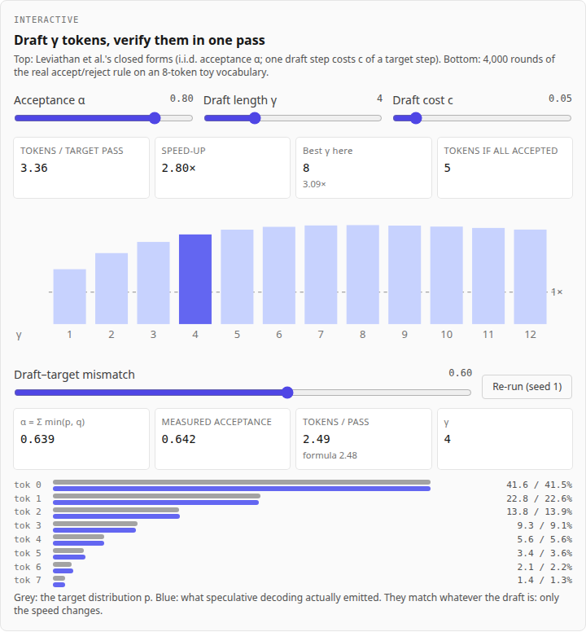

# LLM Inference Explained

A graphical, interactive web explainer of how large language models are
actually served: the generation loop, the KV cache, arithmetic intensity
and the roofline, batching, paged memory, attention kernels, speculative
decoding, quantisation, parallelism, serving metrics and disaggregated
prefill and decode, with a live serving simulator. Every chapter has a
live interactive, and every interactive runs tested code in your browser.

It is the companion to the
[Transformer Decoder Explainer](https://transformer-decoder-explained.vercel.app/),
which shows what happens inside one forward pass. This site picks up where
that one stops: what it takes to run that pass token after token, fast,
for many users at once. The third site,
[LLM Architectures Explained](https://llm-architectures-explained.vercel.app/),
shows how real models' designs differ, and the fourth,
[GPU Kernels Explained](https://gpu-kernels-explained.vercel.app/), shows how
a GPU executes the maths. The sites share one design system and link to each
other from the header ("Decoder · Inference · Architectures · Kernels ·
Numerics · Silicon"; the last two are coming).

**Live:** [llm-inference-explained.vercel.app](https://llm-inference-explained.vercel.app/)



## Part of

This project sits in the [LLMs](https://github.com/BrendanJamesLynskey/LLMs)
hub (Hardware & Inference sub-area), next to the
[Transformer Decoder Explainer](https://github.com/BrendanJamesLynskey/transformer-explainer)
and the [LLM Inference Simulators](https://brendanjameslynskey.github.io/LLM_Hub_Inference_Simulators/)
slide series, whose glossary and decks every chapter links into ("Go deeper").

## What you can do

Fourteen chapters at `/learn`, each with Concept / Maths / Code layers to toggle:

| #   | Chapter                               | Interactive                                                                                                          |
| --- | ------------------------------------- | -------------------------------------------------------------------------------------------------------------------- |
| 1   | From forward pass to generation loop  | Prefill a prompt, then decode token by token with a real tiny model                                                  |
| 2   | The KV cache                          | Watch the cache fill and check it against full recomputation, bit for bit; a KV-size calculator (MHA, GQA, MQA, MLA) |
| 3   | Arithmetic intensity and the roofline | Prefill and decode steps on an H100/A100 roofline                                                                    |
| 4   | Batching                              | Static, dynamic, continuous and chunked-prefill scheduling on the same request stream                                |
| 5   | Memory management                     | A paged KV cache: block tables, prefix sharing, copy-on-write, preemption                                            |
| 6   | Attention kernels                     | FlashAttention's HBM traffic; tiled and split-K attention checked against the textbook result                        |
| 7   | Speculative decoding                  | Expected tokens per pass and speed-up; a Monte Carlo run of the real verify rule                                     |
| 8   | Quantisation for inference            | Weight and KV formats against bytes per decode step and step time                                                    |
| 9   | Parallelism                           | Tensor, pipeline and expert parallelism: what each sends, on which link                                              |
| 10  | Serving metrics                       | TTFT, TPOT, ITL, goodput and Little's law on a simulated run                                                         |
| 11  | Why disaggregate                      | One request stream, colocated and disaggregated: the stalls prefill causes in decode                                 |
| 12  | Moving the KV cache                   | Hand-off size and time per link; compression; layer-wise streaming                                                   |
| 13  | A live disaggregated simulator        | The simulator's own engine: pools, devices, links, compression, load and SLOs; presets that reproduce results.md     |
| 14  | Trade-offs: when not to disaggregate  | A load sweep, colocated against 1P1D, for a small and a large model and three links                                  |

## Screenshots

|                                               |                                                              |
| --------------------------------------------- | ------------------------------------------------------------ |
|    |              |
|  |                 |
|  |  |

Regenerate them with `pnpm build && pnpm start` in one shell and
`pnpm screenshots` in another.

## Where the numbers come from

- **The live tiny model** (chapters 1 and 2, and the landing page's figure)
  is the Transformer Decoder Explainer's pure-TypeScript transformer, vendored
  in `src/lib/transformer/` and extended with a KV cache
  (`src/lib/transformer/kvcache.ts`). `tests/unit/transformer/kvcache.test.ts`
  proves cached generation gives **identical** logits to recomputing the whole
  sequence (exact equality, no tolerance) on two model sizes, and that the
  cache does a fraction of the FLOPs. Its weights are random, so its text is
  gibberish; the arithmetic is real.
- **Hardware, models and step times** come from the roofline cost model of
  [Disaggregated_Inference_Sim](https://github.com/BrendanJamesLynskey/Disaggregated_Inference_Sim)
  (`src/disagg_sim/hardware.py`), ported to `src/lib/inference/costModel.ts`
  with the same float-operation order. `scripts/cost_reference.py` runs the
  Python original on 1,284 steps and writes `tests/unit/fixtures/cost_model.json`
  (the simulator commit is recorded in it); the unit tests match it exactly,
  except the documented cube-root tolerance in the power-capped branch, and
  also reproduce every row of the simulator's
  [results.md §1](https://github.com/BrendanJamesLynskey/Disaggregated_Inference_Sim/blob/main/examples/results.md).
- **The live simulator** (chapters 11–14) is Disaggregated_Inference_Sim's
  own JavaScript engine, `web/sim_engine.js`, vendored byte for byte into
  `src/lib/disagg/vendor/` by `pnpm vendor:sim <commit>`, which records the
  commit and the file's SHA-256 in `VENDORED.json`. It is pinned at
  [`38c655e`](https://github.com/BrendanJamesLynskey/Disaggregated_Inference_Sim/tree/38c655e39302d159e09c65f00e8aaaa741bdd238).
  `scripts/disagg_reference.py` runs the Python package at the same commit
  and writes three things: engine-parity fixtures (13 configurations; every
  request's six timestamps, every instance's energy counters and the link's
  must match, bit for bit for 12 of them and to 1e-9 for the one whose power
  cap takes cube roots, the documented tolerance); the 31 rows of the
  simulator's
  [results.md](https://github.com/BrendanJamesLynskey/Disaggregated_Inference_Sim/blob/38c655e39302d159e09c65f00e8aaaa741bdd238/examples/results.md)
  that the chapters quote, each checked against the recorded line; and the
  recorded workloads in `public/disagg/workloads/` that the browser runs on
  (Python's generator, recorded: a JavaScript port matches every length but
  V8's `Math.log` differs from glibc's in the last bit for some inputs). The
  Playwright suite selects each preset in the browser and checks the cells
  it shows against the same lines.
- **Every number quoted in a chapter's prose** is recomputed by
  `tests/unit/inference/chapterNumbers.test.ts` (chapters 1–10) and
  `tests/unit/disagg/chapterNumbers.test.ts` (11–14), which also check the
  chapter still quotes it.
- **Illustrative** parts are labelled in the chapter: the simulator's
  derating factors and step overhead, the simplified batching scheduler, the
  paging allocator, the first-order communication model, the toy
  speculative-decoding distributions, the simulator's power coefficients,
  the co-packaged-optics link and the optical transform engine (whose
  block-circulant model is speculative), and layer-wise KV streaming (this
  site's closed form; the simulator sends the cache after the prefill).
- Papers are cited by arXiv ID, each checked against arXiv. Claims about
  serving engines (vLLM, SGLang, TensorRT-LLM, Dynamo) are hedged and linked
  to their documentation.

## Stack

The same stack as the Transformer Decoder Explainer, minus the backend:

- **Framework** — Next.js 14 (App Router) + TypeScript (strict)
- **Styling** — Tailwind CSS, Tailwind plugin for ESLint + Prettier
- **Content** — MDX in `/content/inference`, rendered via
  `next-mdx-remote/rsc`, maths by `remark-math` + `rehype-katex` on the
  server, tables by `remark-gfm`
- **Maths** — pure TypeScript; `src/lib/transformer/` (vendored),
  `src/lib/inference/` (calculators and small simulators) and
  `src/lib/disagg/` (the vendored simulator engine and its wrapper)
- **Visualisation** — D3 scales with React-rendered SVG
- **Testing** — Vitest (unit, 100% line coverage on `src/lib/transformer/`,
  95% on `src/lib/inference/` and `src/lib/disagg/`), Playwright (e2e at 1280 and 390 px, light and
  dark, with axe-core accessibility scans)
- **CI / deploy** — GitHub Actions (lint, typecheck, unit, maths, e2e,
  Lighthouse), Vercel

No database and no sign-in: every page is statically rendered, and each
chapter's interactive is code-split so a chapter loads only its own widget.
The simulator interactives (chapters 11, 13, 14) render in the browser only,
loading the engine and the workload they need when the chapter opens, and
run the simulations in a Web Worker so the page stays responsive.

### Design system: where each piece came from

Copied from [transformer-explainer](https://github.com/BrendanJamesLynskey/transformer-explainer)
at commit `5c259da`:

| Here                                                                                                                                               | From the explainer                                                                                              |
| -------------------------------------------------------------------------------------------------------------------------------------------------- | --------------------------------------------------------------------------------------------------------------- |
| `tailwind.config.ts`                                                                                                                               | identical (fonts, `accent` colour, `darkMode: "media"`)                                                         |
| `src/app/globals.css`                                                                                                                              | its file, plus `.mdx-content` rules for chapter headings, lists and tables, and `overflow-wrap` for inline code |
| `src/app/layout.tsx`, `src/components/ui/SiteHeader.tsx`                                                                                           | its layout and header classes; sign-in replaced by the cross-site switch                                        |
| `src/components/interactive/Layer.tsx`, `LayerToggle.tsx`                                                                                          | the three-layer toggle; `Layer`'s label gains a dark-mode colour (contrast)                                     |
| `src/components/viz/BarChart.tsx`                                                                                                                  | unchanged                                                                                                       |
| `src/app/learn/*`, `src/app/page.tsx`, `src/lib/mdx/*`                                                                                             | the same page structure, KaTeX wiring and landing-page pattern                                                  |
| `.eslintrc.json`, `.prettierrc.json`, `tsconfig.json`, `vitest.config.ts`, `playwright.config.ts`, `lighthouserc.json`, `.github/workflows/ci.yml` | adapted (no database, new pages)                                                                                |
| `scripts/smoke-check.ts`, `scripts/capture-screenshots.ts`, `scripts/verify-maths.ts`, `scripts/reference.py`                                      | adapted / vendored                                                                                              |

`src/components/ui/SiteSwitch.tsx` is the cross-site navigation; the same
component, with the same classes, is in the explainer's and LLM
Architectures Explained's headers (only `current` differs). A shared npm
package for the design system would be cleaner in principle, but for three
small sites it would be overkill: copying, and recording where each file
came from, is simpler.

## Local development

- Node ≥ 20.11 and pnpm ≥ 9 (pinned via `packageManager`).
- No environment variables, no database.

```bash
git clone https://github.com/BrendanJamesLynskey/llm-inference-explained
cd llm-inference-explained
pnpm install
pnpm dev                              # http://localhost:3000
```

## Testing

```bash
pnpm lint                  # ESLint + Tailwind plugin
pnpm typecheck             # tsc --noEmit
pnpm format:check          # Prettier --check
pnpm test                  # Vitest unit
pnpm test:coverage         # …with thresholds enforced
pnpm verify:maths          # vendored transformer vs PyTorch fixtures
pnpm test:e2e              # Playwright on a production build (builds first)
pnpm lighthouse            # Lighthouse CI on a `pnpm build` (needs Chrome)
pnpm smoke <url>           # post-deploy check of every page
```

The e2e server runs `next start` under `node --no-experimental-require-module`,
so a server dependency that would only fail on Vercel's runtime fails in CI
too (the lesson of the explainer's RUNBOOK §7).

To regenerate the cost-model fixtures after a change to the simulator:

```bash
python3 scripts/cost_reference.py ../Disaggregated_Inference_Sim
```

To move the live simulator to a new simulator commit (pushed to its origin):

```bash
pnpm vendor:sim <commit> ../Disaggregated_Inference_Sim
git -C ../Disaggregated_Inference_Sim checkout <commit>
../Disaggregated_Inference_Sim/.venv/bin/python scripts/disagg_reference.py ../Disaggregated_Inference_Sim
pnpm test                  # parity, results.md rows, chapter numbers
```

## Deploying

See [`RUNBOOK.md`](RUNBOOK.md): a CLI deploy from a clean `git archive`
export, then `pnpm smoke`.

## Project layout

```
content/inference/          MDX chapters
src/app/                    App Router routes (/, /learn, /learn/[slug], /about)
src/components/interactive/ The chapters' widgets (+ lazy.tsx code-splitting)
src/components/ui/          Header, cross-site switch, widget frame, controls, callouts
src/components/viz/         Static SVG (landing figure) and the bar chart
src/lib/transformer/        Vendored transformer + kvcache.ts
src/lib/inference/          Cost model, KV sizes, batching, paging, kernels,
                            speculative decoding, quantisation, parallelism, metrics
src/lib/disagg/             Vendored simulator engine (vendor/), its wrapper,
                            hand-off closed forms, simulator presets, workloads
public/disagg/workloads/    Recorded workloads the live simulator runs on
tests/unit/                 Vitest, incl. PyTorch and simulator fixtures
tests/e2e/                  Playwright + axe-core
scripts/                    smoke-check, capture-screenshots, verify-maths,
                            reference.py, cost_reference.py, vendor-sim-engine.ts,
                            disagg_reference.py
```

## Credits

- The transformer in `src/lib/transformer/` (all but `kvcache.ts`), its tests
  and its PyTorch fixtures are from
  [transformer-explainer](https://github.com/BrendanJamesLynskey/transformer-explainer)
  (MIT), vendored unchanged at commit `5c259da`.
- The cost model is ported from, and the simulator engine in
  `src/lib/disagg/vendor/` is vendored unchanged from,
  [Disaggregated_Inference_Sim](https://github.com/BrendanJamesLynskey/Disaggregated_Inference_Sim)
  (same author; its `pyproject.toml` declares "Educational use").

## References

- Vaswani et al., 2017 — _[Attention Is All You Need](https://arxiv.org/abs/1706.03762)_
- Kwon et al., 2023 — _[Efficient Memory Management for Large Language Model Serving with PagedAttention](https://arxiv.org/abs/2309.06180)_
- Agrawal et al., 2023/2024 — _[SARATHI](https://arxiv.org/abs/2308.16369)_, _[Sarathi-Serve](https://arxiv.org/abs/2403.02310)_
- Dao et al., 2022 — _[FlashAttention](https://arxiv.org/abs/2205.14135)_; Dao, 2023 — _[FlashAttention-2](https://arxiv.org/abs/2307.08691)_
- Leviathan, Kalman and Matias, 2022 — _[Fast Inference from Transformers via Speculative Decoding](https://arxiv.org/abs/2211.17192)_
- Ainslie et al., 2023 — _[GQA](https://arxiv.org/abs/2305.13245)_; DeepSeek-AI, 2024 — _[DeepSeek-V2](https://arxiv.org/abs/2405.04434)_
- Shoeybi et al., 2019 — _[Megatron-LM](https://arxiv.org/abs/1909.08053)_
- Zhong et al., 2024 — _[DistServe](https://arxiv.org/abs/2401.09670)_
- Patel et al., 2023 — _[Splitwise](https://arxiv.org/abs/2311.18677)_; Hu et al., 2024 — _[Inference without Interference](https://arxiv.org/abs/2401.11181)_; Qin et al., 2024 — _[Mooncake](https://arxiv.org/abs/2407.00079)_

Each chapter lists the rest.

## Contributing

PRs welcome. CI runs `format:check`, `lint`, `typecheck`, unit tests with
coverage thresholds, `verify:maths`, e2e on a production build, and
Lighthouse CI (performance, accessibility and best practices must each
score at least 90 on `/`, `/learn`, `/learn/02-kv-cache`,
`/learn/04-batching` and `/learn/13-live-simulator`).

## Licence

MIT — see [`LICENSE`](LICENSE).
